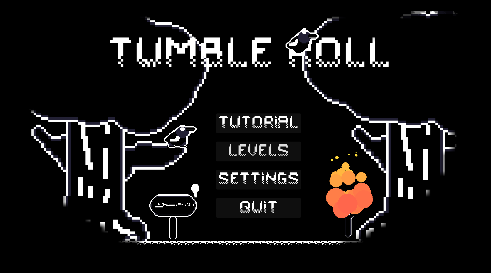

# Godot Wild Jam 72 - Light and Dark

## Overview

This project was created for **The Godot Wild Jam 72** competition. Although I was unable to complete it before the submission deadline, it remains a work in progress with potential. The theme for this jam was **light and dark**, and my goal was to create a game that balances a relaxing atmosphere with fun and engaging gameplay as darkness looms closer.

Link: https://yothesif.itch.io/tumbleroll

---

## 🎨 Concept & Theme

The theme, **light and dark**, inspired me to craft a game that intertwines these two forces both visually and mechanically. I wanted the game to have a calming vibe, allowing players to enjoy a peaceful experience while still being challenged by unique gameplay elements tied to this theme.In this game, you play as a bird who is unable to fly properly and embark on a quest to find out why. I wanted to include a darkness that gradually engulfs the player's view unless they reach a light source, such as a torch, to repel the darkness. Collecting all of the hearts will reveal a secret in the end, however I have yet to go that far.

---

## Ideas & Planning

The initial idea was to create a fun game that resonated with the jam’s theme. I brainstormed different games where light and dark are implemented into both the mechanics and the aesthetics of the game. I used trello to write down some ideas and track my progress.

  

The game was planned with the following key principles:

- **Mechanics**: Start with one mechanic and build off other mechanic.
- **Engagement**: Incorporate light and dark as a gameplay mechanic that keeps players intrigued.
- **Balance**: Ensure the game wasn’t too easy but still accessible to players looking for a laid-back experience.

---

## Mechanics

The game has 3 core mechanics

**Tucking**: Holding left click with allow you to tuck. This allows you to crawl into smaller unreachable places and also increases your movement speed by 10%. Later on, It can be used to dodge enemy attacks or escape certain situations.
**Glide**: Although you cannot fly, you have the ability to glide in the air. The glide ability activates automatically when you double jump and it also gives you invincibility for 2 seconds and a small speed boost and afterwards you slowly start to decend back to the ground.
**Roll**: The roll ability only activates when your right click while in the air. This roll ability allows you to reset your glide ability and has a cooldown of 1.5 seconds. This ability allows you to get more air time and with precision timing, you can infinitely glide.

---

## Artwork & Enviroment

The **art style** was designed in the form of pixel art, using a basic palette of clours that complement the light and dark theme. The goal was to create an **immersive environment** where the aesthetics support the gameplay. To create my artwork, I Used aseprite and for  the sound effects, I sourced them online.

---

## Challenges

The most significant challenge I faced was **time management**. Due to the tight schedule, I couldn't complete the game in time for submission. Balancing the game’s relaxing nature with fun and engaging gameplay proved more challenging than I initially thought. There were also technical hurdles, particularly in implementing light and dark mechanics fluidly within the game.

---

## Future Plans

Even though I missed the jam deadline, I’m committed to **finishing this project**. Moving forward, I plan to:

- Refine the gameplay mechanics.
- Enhance the art and sound design.
- Introduce enemies and traps.
- Add NPCs to create a story line.
- Add more levels and complexity to make the gameplay more challenging.
- Polish the user experience for smoother gameplay.

Although the game is in it's beta stage, it still has a lot of potential, and I’m excited to see where it goes!
Here are some more images from the game

---
